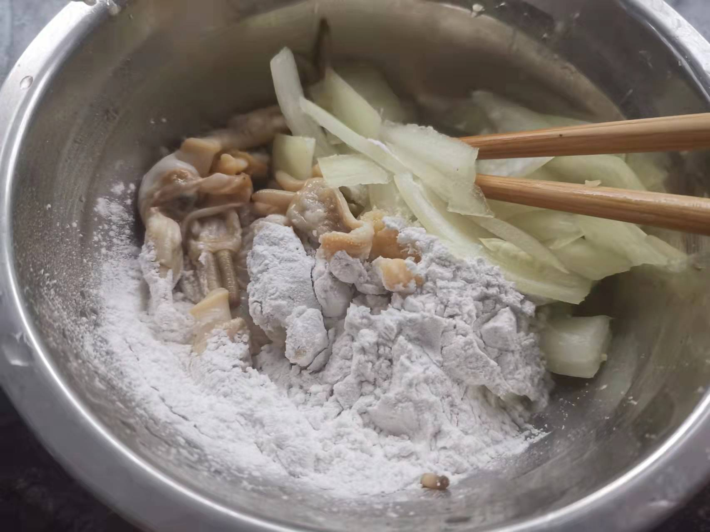
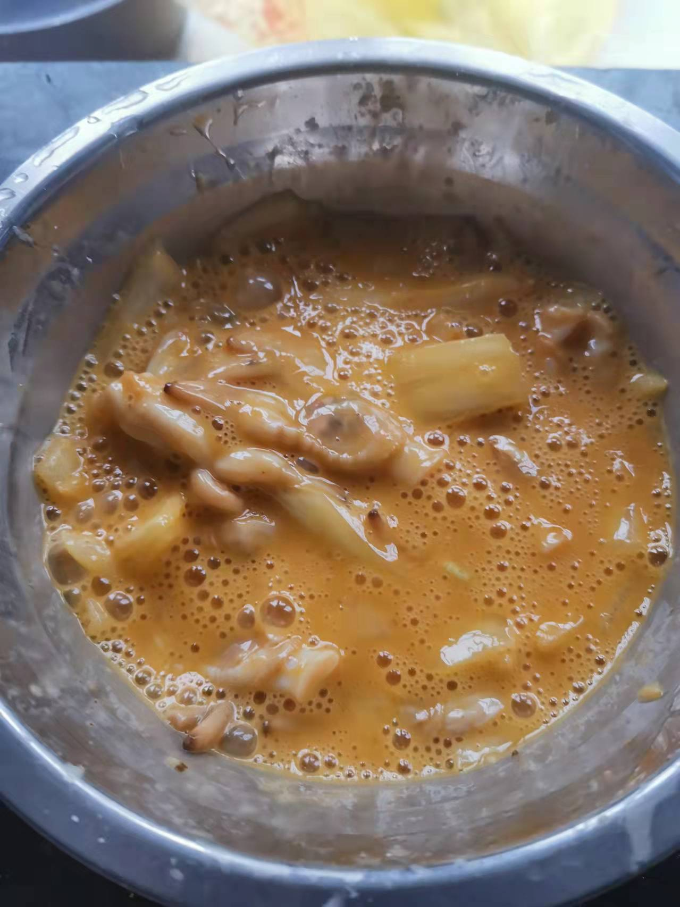
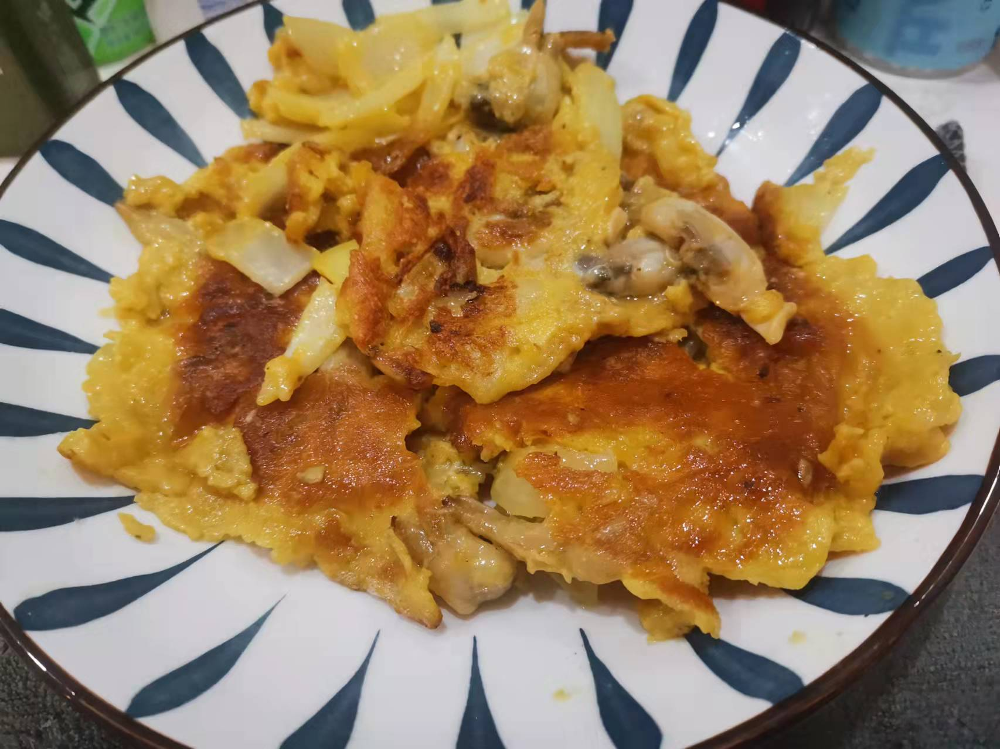

# How to hold eggs with clams

Clams hold eggs, a traditional home-cooked dish that is popular in Fuzhou, Fujian Province

Estimated cooking difficulty: ★★★

## Essential raw materials and tools

* Rice clams
* egg
* Edible oil
* onion
* starch
* Soup
* Chicken Essence
* Cooking wine

## calculate

Each serving:

* Razor clams 200 g
* 2 eggs
* edible oil 100 ml
* Onions 0.25
* Starch 20 g
* Soup soy sauce 5 ml
* Chicken Essence 5 ml
* Cooking wine 5 ml

## operate

* Boil water, put the clams in the water, boil for 2 minutes, remove the shells, and put them in a large bowl
* Add onion, light soy sauce, cooking wine, chicken essence and raw powder to a large bowl, stir thoroughly
* Beat 2 eggs into a large bowl and continue to stir
* Boil the oil in the pot, pour the clams into the bowl, fry until the side is golden, turn over and continue frying

## Additional content

* In more cases, local areas in Fuzhou will use horse hoof (relieving greasy) and potato (washing oil). Because they can't buy it during the epidemic, they use pineapple.
* Fujian cuisine is mainly sweet. If you can't get used to it, you can give up sugar.
* You can use a spoon to beat the lean meat piece and hear the sound to determine whether the lean meat is fried thoroughly.

If you follow the production process of this guide and find problems or processes that can be improved, please ask an Issue or Pull request.