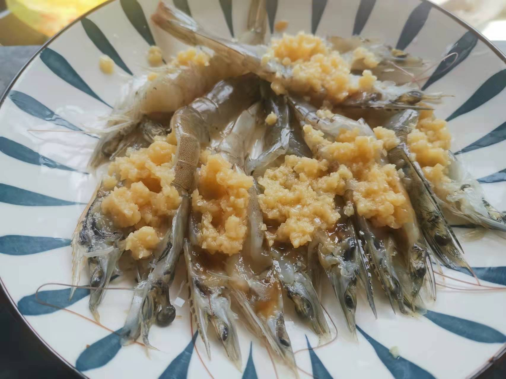
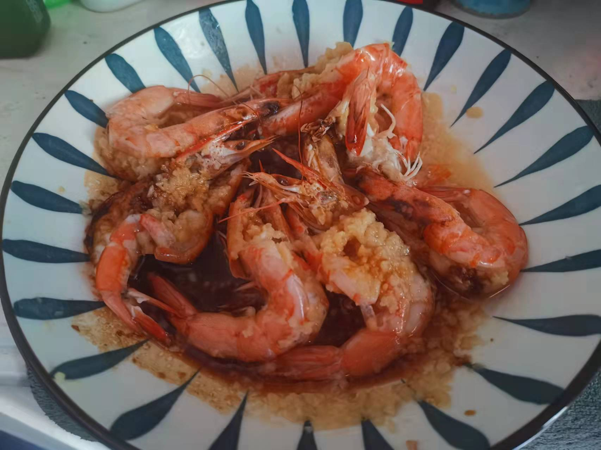

# How to make garlic shrimp

Garlic shrimp is a local traditional famous dish in Guangdong Province, with a full range of colors, fragrance and taste.

Estimated cooking difficulty: ★★

## Essential raw materials and tools

* Sea shrimp
* Garlic sauce
* Edible oil
* Soup

## calculate

Each serving:

* 8 shrimps
* Garlic sauce 50 g
* edible oil 20 ml
* Soup soy sauce 5 ml

## operate

* Use a knife to cut from the middle of the shrimp head and cut to 1 cm away from the shrimp tail.
* Spread garlic sauce in the middle of the shrimp and place it on a plate
* Pour hot water into the pot, put the plate into the pot, and steam over high heat for 3 minutes
* Heat oil, pour it into a shrimp dish, pour it into a soy sauce

## Additional content

If you follow the production process of this guide and find problems or processes that can be improved, please ask an Issue or Pull request.