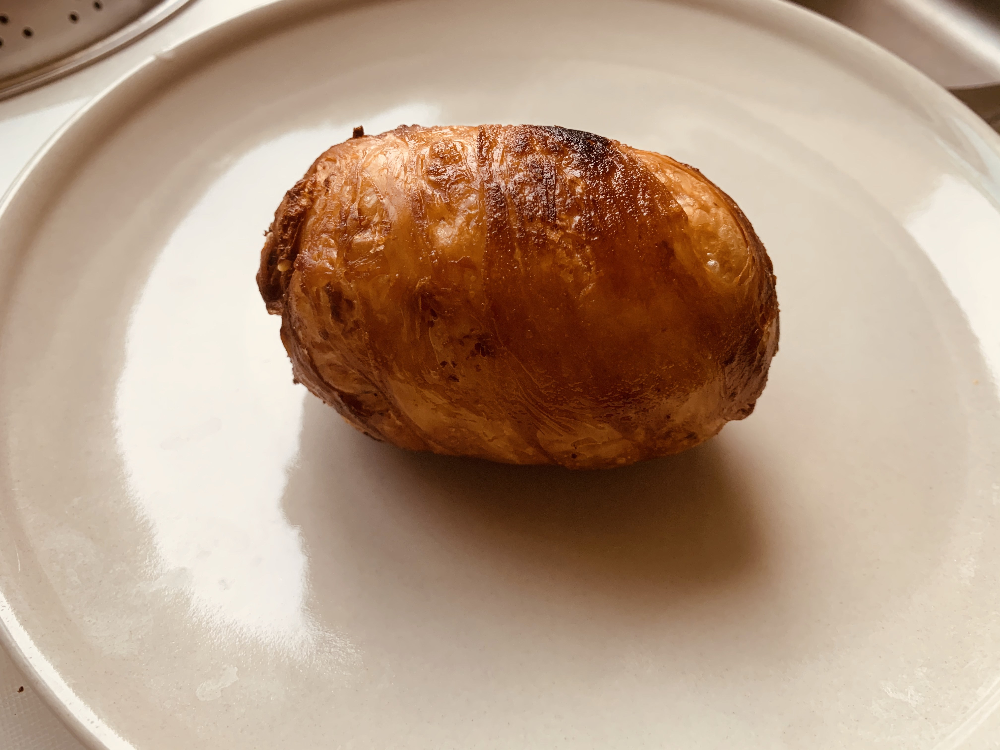

<!-- This is a sample recipe template file in the HowToCook recipe warehouse.-->
<!-- Note: When writing, there must be and only one space between Chinese and English or numbers.-->
<!-- Note: When writing, there must be and only one blank line between the title and the body.-->

# How to make Scottish eggs

<!-- The title must be `Dish Name` + `Preparation`.Consistent with the file name.-->

<!-- If there is a picture, it's better.-->

Scottish eggs are made of wrapping fresh meat minced eggs and frying them in oil until golden brown. This version is quite troublesome, so I will bring you a simple version, and everyone will search for the complex version of Scottish eggs by themselves.

The simple version of Scottish eggs is made by wrapping cheese, bacon, sugar eggs with hand-catch crusts and frying them in oil until golden brown. It takes about 20-30 minutes.

Estimated cooking difficulty: ★★★

## Essential raw materials and tools

- egg
- Hand-grabbing pie crust
- Cheese
- Bacon
- Air fryer or oil pan

## calculate

> One serving

- 50g egg (about 1 pc)
- Hand-grabbed cake 1 serving - 2 servings (just the size of the egg)
- Cheese slices 1-2 slices
- Bacon slices 1-2 slices

## operate

- Put it in cold water and boil it in 3 minutes before taking it out
- Take out the eggs and put them in ice water to peel them faster and more complete
- Wrap eggs with cheese slices
- Bacon slices wrapped in eggs
- Cut the two ends of the cake and wrap the eggs in a rectangular shape
- Oil temperature is 60% put into the pot (the oil surface fluctuates, there is blue smoke, and the chopsticks are inserted into the oil and bubbles appear around it, which is 60% temperature) Fry it and make golden
- Air Fryer 160 degrees 15 minutes
- Cut it and serve

## Additional content

- Cheese slices, bacon slices, and hand-catch cakes can be purchased directly on Taobao

If you follow the production process of this guide and find problems or processes that can be improved, please ask an Issue or Pull request.