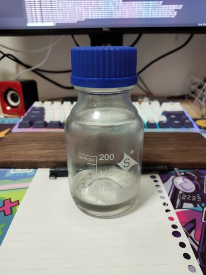

# How to make sucrose syrup

Dissolve the sugar in advance to make it sweeter when preparing beverages (especially cold drinks)

Estimated cooking difficulty: ★

## Essential raw materials and tools

raw material

- White sugar
- water

tool

- Sealed container (it is recommended to use high borosilicate reagent bottle, which is cheap)

## calculate

Suggested ratio => Sugar: Water = 1: 1, which facilitates the control of sugar content. For example, if you want 15 grams of sugar, take 30 grams of syrup.

- 100 grams of water
- White sugar 100g

## operate

1. Mix the drinking water of the weighed white sugar in the container
2. Store the container cover in the refrigerator

## Additional content

Water is free of hot or cold. If it is urgent, you can dissolve it in hot water before cooling the syrup.

The prepared syrup will not deteriorate easily, and it is usually okay to store it in refrigerated condition for a week.

If you follow the production process of this guide and find problems or processes that can be improved, please ask an Issue or Pull request.