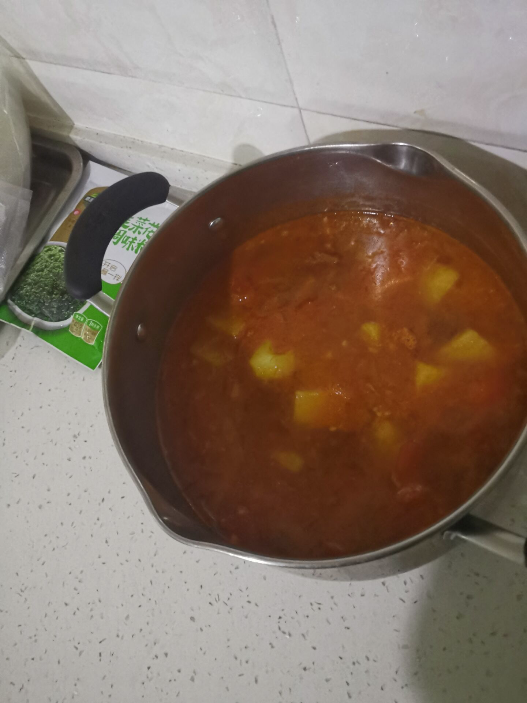

# How to make beef stewed with tomatoes and potatoes

The characteristic of beef stewed with tomatoes and potatoes is that it is quite delicious. The beef has high-quality protein, which makes it even better to replace it with beef brisket.

There is basically no difficulty, and a 90-year-old grandma can do it with crutches.

It is expected that the production will be 1 to 1.5 hours in total.Time of stewing: time of making ≈3:1

Estimated cooking difficulty: ★★★★

## Essential raw materials and tools

- beef
- Small material
- onion
- ginger
- Cooking wine
- Sichuan peppercorn
- Star Anise
- Xiangye
- White sugar or rock sugar
- Soy sauce (optional)
- Soy
- Black pepper (or white pepper)
- Potato
- tomato
- onion

## calculate

- Beef 500-700g
- Small material
- One onion, four slices of ginger, cooking wine
- Pepper 3g
- One (and a half)
- Two bay leaves
- Oil 15ml (If you use beef brisket, you can reduce it to 10ml according to your preference)
- Condiments
- White sugar or rock sugar
- Soy sauce (Qianhe brewed light soy sauce without addition), Laos
- Black pepper (white ones are OK) 2g
- Two or three potatoes (depending on your preference, the pot can be served)
- Tomato fist size, medium size, two or three
- an onion a little bigger than a fist

## operate

- Prepare dishes:
- Peel the potatoes and cut them into 5cm chunks, set aside
- Cut tomatoes with crossbow, scald it in boiling water and peel it, remove the core in the middle, cut it into 3cm small pieces for later use
- Cut 4g of scallions into flakes, break the rest into 5-8cm large pieces
- Soak the beef in cold water for half an hour to remove the blood, or put it in a pot and cook until the surface turns white and remove it. Skim off the floating powder during the period
- Onion cut 0.5-1cm small particles
- Production
- Fire throughout
- The beef is covered with cold water, put it in a pressure cooker, add onion slices, ginger slices, add 20g cooking wine, SAIC pressure for 20 minutes
- After taking out the beef, cut into 5cm large pieces, pick out the ginger, and serve the soup in a large bowl for a while to stew
- Pour oil, add 40% to 50% of the oil and add star anise leaves of pepper and star anise. After the aroma is released, pick it out before pasting.
- Add beef, green onion, ginger, stir-fry, it doesn't matter how long it takes, it seems a bit mushy, you can scoop 10ml of soup, the same is true for this
- After stir-frying, add 15ml of light soy sauce, 15ml of cooking wine, pepper, 5-10g tomato paste, tomato sauce or a canned tomato, add onion and stir-fry until transparent
- (Optional) You can add a little salt to make the onion not easy to get out of water. Don't add too much and then season it later.
- Add tomatoes and stir-fry until the tomatoes are soft and soft, pour in the remaining soup
- Stew and cook
- After boiling the pot in medium heat, low heat throughout the whole process
- Add potatoes and season them 30-40 minutes before serving
- Add sugar salt while tasting according to personal taste, until appropriate
- The beef is soft and rotten and then released from the pot!

## Additional content

- Make sure the soup is warm when added when stewing
- Do not buckle the cover when stewing or the potatoes will rot
- Stew and turn it from time to time to avoid the bottom
- Stewed casserole is even better. You can stir-fry in the wok and pour it into the cooking pot. If you use the casserole to boil the pot, do not use high heat to avoid cracking
- Don't have too much soy sauce. The soup will become salty when concentrated. It's okay to lighten it when it is thin. When it is not enough when it is stewed, you can add soy sauce.
- Do not use chicken essence MSG, as it will snatch the freshness of beef

If you follow the production process of this guide and find problems or processes that can be improved, please ask an Issue or Pull request.