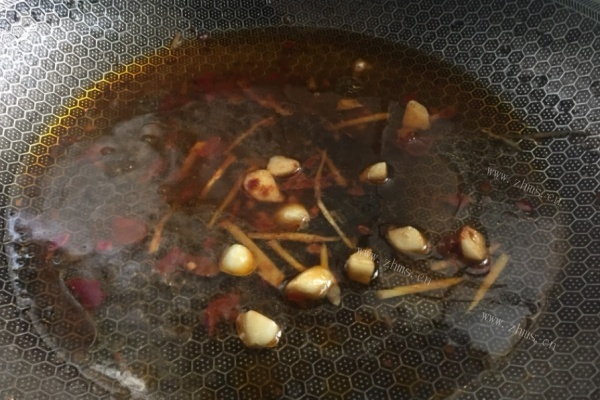

# How to cook beef in water

Spicy and fresh

Estimated cooking difficulty: ★★★

## Essential raw materials and tools

- beef
- Bean sprouts
- egg
- coriander
- Douban Sauce
- Cooking wine
- starch
- Dried chili powder
- ginger
- garlic
- Red pepper
- Oyster sauce

## calculate

You need to determine how many copies you plan to make before each production.One serving is just enough for 2 people to eat.

This is a quantity of one serving:

- Beef 300g
- Bean sprouts 100g
- 1 egg
- 5 coriander
- Douban sauce 10g
- Cooking wine 10ml
- Starch 15g
- Dried chili powder 5g
- Ginger 20g
- 3 garlic cloves
- 1 red pepper
- Oyster sauce 8g

## operate

- Wash and slice the beef.

- Add 15g shredded ginger, 1 egg, 15g starch, 8g oyster sauce, 10ml cooking wine and stir well, marinate for 15 minutes.

- Wash the coriander and cut it.

- Pour oil into the pot, add bean paste, 5g shredded ginger, and sliced ​​garlic.

- Pour in boiling water and boil into red soup.

- Wash the bean sprouts and remove the tail whiskers, put them in boiling water and blanch them.

- Spread bean sprouts into the bottom of the bowl.

- Put the beef slices into the red soup piece by piece and remove after it is cooked.

- Spread the beef on the bean sprouts and sprinkle with coriander stems.

- Sprinkle with coriander leaves, chili powder, chili rings.

- Heat the oil in a pot and pour the hot oil on the top of the dish and it's done.

## Additional content

- Reference: [Detailed steps for boiling beef](https://www.zhms.cn/recipe/blrqm.html?source=2)

If you follow the production process of this guide and find problems or processes that can be improved, please ask an Issue or Pull request.