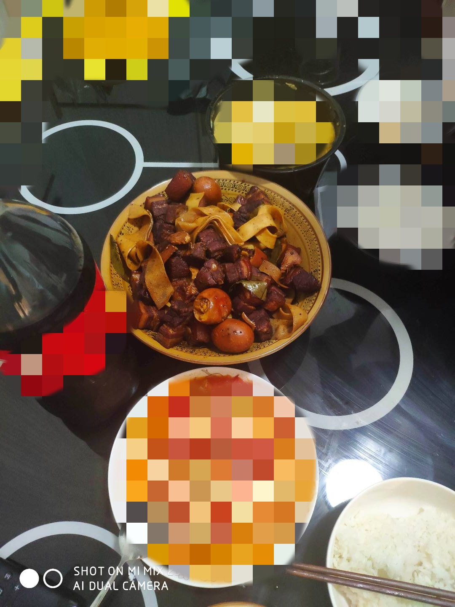

# Simple braised pork recipe

This braised pork tutorial is an unbeaten recipe for beginners.It is delicious with rice and can't stop. The fragrant and glutinous stick is tempting and fat but not greasy.It is recommended to eat it with rice.

Estimated cooking difficulty: ★★★

## Essential raw materials and tools

- Note: If possible, try to sharpen the knife as sharp as possible.
- Main ingredients: `Big meat`, `Egg` (optional), `Bean peel` (optional)
- Auxiliary ingredients: `Ginger`, `rock sugar`, `sood soy sauce`, `dark soy sauce`, `cooking wine`, `baby leaves`, `star anise, salt`, `water`, `sing onion` (remember to boil water)

## calculate

You need to determine how many copies you plan to make before each production.One serving is just enough for 2-3 individuals.

If only 1 person eats it, you can consider halving the ingredients.

- Pork pork belly: about 3~4 pounds
- Ginger: 6 slices
- Rock sugar: 15 grams (about 7 pieces)
- Soup soy sauce: 10ml
- Damn soy: 15ml
- Cooking wine: 5ml
- Boiling water: The amount of ingredients is not exceeded, 600ml-900ml is required
- Baby Leaf: 3 pieces
- Star anise: 2 pieces
- Quail eggs (optional, no quail eggs, you can replace them with eggs of the same weight): 0-2
- Bean peel (optional): 0-80g
- Salt: 2-3g

## operate

### Raw material preparation

- Cut pork belly into large pieces (about 4.5cm, freeze for half an hour to one hour and cut it better)
- `Bean peel` cut 2cm width
- `Ginger` slices (each slice is about 3mm thick)
- `Water` boils
- `Quail eggs` are cooked and holed with `fork`/`toothpick` (try to make it taste good)
- `Scallion`Scallion`White part of green onion`White part of green onion`

### Start making

- Add the cut pork belly to the cold water pot, add cooking wine and onion and ginger, and cook for 15 minutes to remove the blood
- Put two slices of ginger in the pot to enhance the flavor
- Add `pork belly` directly after turning on medium-low heat. No cooking oil is needed. Fry six noodles of each piece of `pork belly` and fry until oil is released.
- Pour out the fried oil and set aside, push the pork belly aside, add 15g of `rock sugar` and stir fry until the rock sugar melts;
- After melting, fry pork belly and rock sugar until combined and add
- `So Soup` 10ml
- `Dark soy` 15ml
- `Cooking Wine` 5ml
- Stir until colored;
- Add `boiled boiled water` and stew for 40 minutes (students with poor knife skills cut too much, please consciously extend the stewing time), and put it in
- `Ginger` 2 slices
- `Balcony Leaf` 3 pieces
- `Star Anise` 2 pieces
- Cover the pot and cook until boiling, add the `quail eggs` and `bean skin` that have been cooked and laid well, turn on medium-low heat, and wait for 40 minutes.(Can appropriately stir the pot in the middle of the process);
- Open the lid of the pot and turn on high heat to stop the juice when the soup is almost gone (remember not to stop dry);
- Add 2-3g of `salt`, stir fry, and it's ready to be served.

## Additional content

If you follow the production process of this guide and find problems or processes that can be improved, please ask an Issue or Pull request.