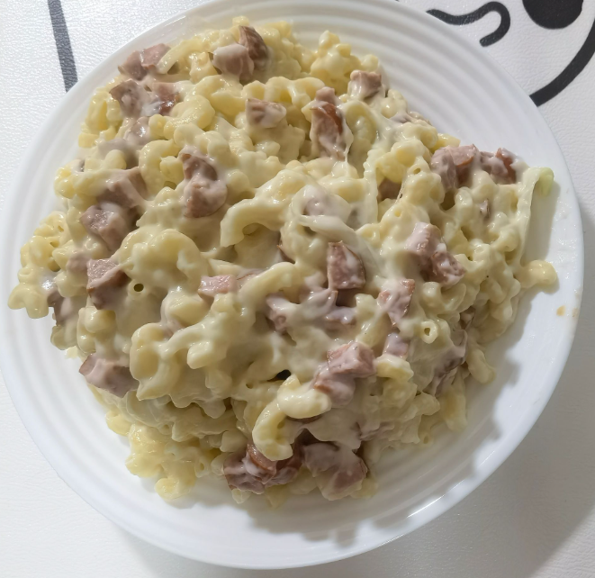

# How to make cheese, bacon, macaroni

This is a delicious dish of mac and cheese for four.It combines rich cheese with crispy bacon, easy to make and is a popular American home-cooked dish.

Estimated cooking difficulty: ★★★

## Essential raw materials and tools

- Macaroni
- cheese
- Meat
- onion
- butter
- flour
- milk
- garlic

## calculate

You need to determine how many copies you plan to make before each production.One serving is just enough for 2 people to eat.

- Macaroni 100-125g
- 40-55g cheese, for baking, 25g extra, strips
- Bacon or other meat 100-125g
- Onion 25g-40g cut into pieces
- Butter 15g
- Flour 10g
- Milk 125ml
- Half a clove of garlic, chopped

## operate

- The cheese needs to be ground into crumbs
- Cut onions into strips
- Boil macaroni in slightly salty water for 6 minutes
- **Medium Fire**
- Put butter in the pot and wait for it to melt
- Add onion
- Add garlic after softening the onion
- After the garlic aroma comes out, add meat and wait for 5 seconds
- **Low Fire**
- Add the milk in four times, stir each time for 5 seconds and then add the next time
- Add flour and stir thoroughly
- Add cheese and stir well
- Stir macaroni and cheese
- If you don't plan to bake, you can eat it directly
- **Baking: **
- Preheat the oven to 180°C
- Spread an extra 50g of cheese over macaroni
- After waiting for the oven to preheat to 180°C, put the macaroni in
- Bake until golden on the surface, about 24 minutes

## Additional content

This dish is very unhealthy, with about 1300 calories and 80g of fat, so it is not recommended to eat it regularly.

If you follow the production process of this guide and find problems or processes that can be improved, please ask an Issue or Pull request.