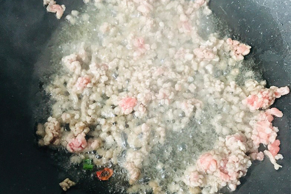
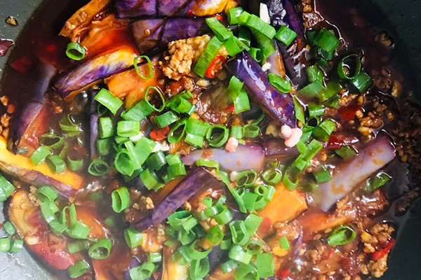

# How to make fish-flavored eggplant

This dish is really super delicious, just be the king of dry rice.

Estimated cooking difficulty: ★★★

## Essential raw materials and tools

- eggplant
- Minced meat
- Salt
- sugar
- MSG
- Soup soy sauce
- Soy
- vinegar
- Water starch
- Douban Sauce

## calculate

You need to determine how many copies you plan to make before each production.One serving is just enough for one person to eat.

- 2 eggplant
- Minced meat 20g
- Salt 3-5g
- Sugar 5-10g
- MSG 5g
- Soup soy sauce 10ml
- Dark soy 5ml
- Vinegar 10ml
- Water starch 100ml
- Douban sauce 20-30g
- Spicy green onion, ginger, garlic, millet (according to your own taste)

## operate

- Cut the eggplant into strips.

- Cut the meat into meat, chop the onion, ginger, garlic, and diced millet and pepper.

- Mix fish sauce: Add salt, MSG, sugar, light soy sauce, dark soy sauce, vinegar, water and starch to the bowl and stir evenly.
- Pour 300ml of oil into the pot, turn on low heat (low heat is easy to control), wait for the oil temperature to be 70% hot (low heat for about 40 seconds, smoke comes out) Put in the eggplant and fry for two minutes, and take it out when the edges of the eggplant are slightly yellow.The extra oil can be served and then stir-fry.

- Leave 15-30ml of oil in the pot, pour in the meat and stir-fry until the color turns white and serve.

- Pour 15-30ml of oil into the pot, add bean paste, green onion, ginger and garlic and stir-fry, then pour in the meat foam and stir-fry evenly.

- Add 80-150ml of clean water (the estimated height of eggplant on the water surface is 80% the height), pour in the eggplant, pour in the sauce, stir-fry and add the flavor and juice.Finally, add the green onions and stir-fry evenly, and then you can start the pot.

## Additional content

- Eggplant depends on personal preference. You can peel it and add more meat.
- Reference: [Detailed steps for fish-flavored eggplant](https://www.zhms.cn/recipe/kbbrl.html?source=2)

If you follow the production process of this guide and find problems or processes that can be improved, please ask an Issue or Pull request.