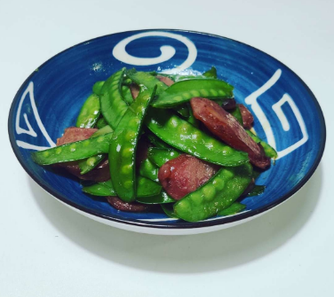
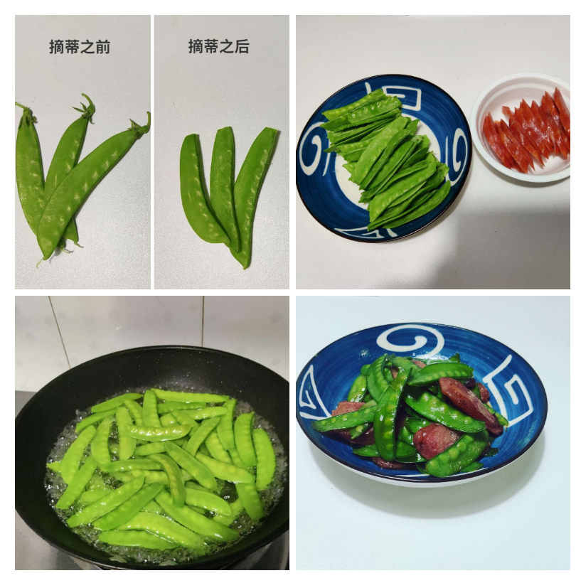

# How to make fried sausages with Dutch beans

Fried Dutch bean sausage is a delicious dish that is nutritious and refreshing, which is conducive to appetizing and aiding food and enhancing appetite.Dutch beans are rich in various nutrients needed by the human body, especially high-quality protein, which can improve the body's disease resistance and recovery ability.

Estimated cooking difficulty: ★★

## Essential raw materials and tools

- Dutch beans
- Sausage
- Soup soy sauce
- Edible oil

## calculate

Below is one person.

Each serving:

- About 50 Dutch beans
- About 100 g of sausage
- Edible oil 10ml
- Soup soy sauce 10ml

## operate

- Remove the stems of the Dutch beans, and if you have time, you can also remove the tail at the same time

- Before buying sausage, you can ask the boss whether it is raw or cooked. If it is raw, you need to steam it in advance. If it is cooked, you can use it directly.

- Wash the Dutch beans and blanch them for about 45 seconds. Blanch the Dutch beans until they change color. Take them out and set aside for cold water.

- Heat the pan and put about 10ml of cooking oil in the pan.Wait for 10 seconds to let the oil temperature rise

- Add the sausage and keep stir-fry until the sausage is slightly curled. Note that you must keep the heat at a low heat here, which is too small to small, otherwise it will be easy to get paste.

- Add Dutch beans, turn to medium-high heat, stir-fry for 30 seconds, add light soy sauce, and then stir-fry for 20-30 seconds

## Additional content

- No salt was added during the production process because the sausage itself will have some flavor, and the light soy sauce will also have some saltiness.
- Although the sausage tastes good, it is a not very healthy food, so it is recommended to put less.

If you follow the production process of this guide and find problems or processes that can be improved, please ask an Issue or Pull request.