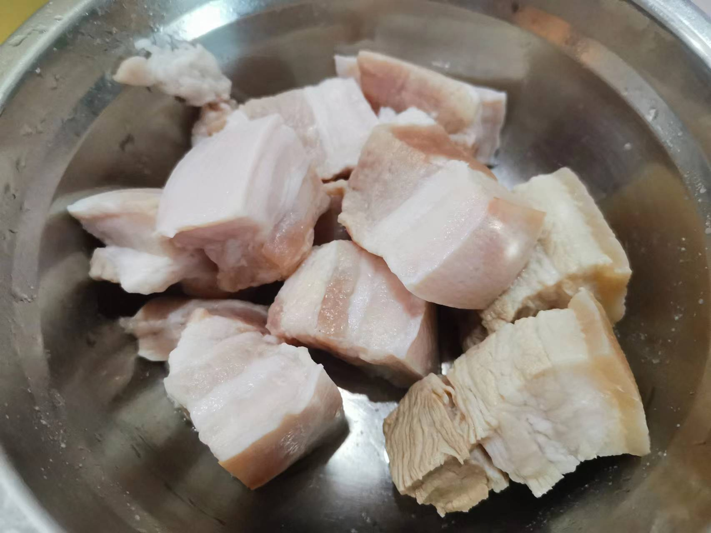

# How to make Huipai braised pork

Hui-style braised pork is a dish made of ingredients such as pork belly.

Estimated cooking difficulty: ★★★★

## Essential raw materials and tools

* Pork Belly
* White sugar
* Edible oil
* Soup
* Oyster sauce
* Smoked
* Ginger slices
* Garlic
* Cooking wine
* onion
* Five-spice powder
* Salt

## calculate

Each serving:

* Pork Belly 300 g
* White sugar 100 g
* Edible oil 200 g
* Soup soy sauce 10 ml
* Oyster sauce 5 ml
* Dark soy 5 ml
* 2 slices of ginger
* 3 garlic
* Cooking wine 100 ml
* 1 onion
* Five-spice powder 10 g
*Salt 10 g

## operate

* Cut pork belly into pieces, 2-3 cm each size
* Add 150 ml of cooking oil to the pot, pour in pork belly, fry for 2 minutes, add salt, stir-fry pork belly, and then leave the pot for 2 minutes
* Add 50 ml of cooking oil to the pot, pour in white sugar, stir-fry until coffee-colored
* Pour in pork belly, stir-fry for 30 S, add sliced ​​ginger and garlic and stir-fry for 30 S
* Add cooking wine, five-spice powder, green onion, add water to cover the pot and cook for 10 minutes
* Add light soy sauce, dark soy sauce, and oyster sauce and cook for medium heat for 20 minutes
* Open the pot, cook the juice over high heat, serve the plate

## Additional content

* The onion is a whole, and it does not need to be chopped
* Step 2 The purpose of adding salt is to lock in the fat of pork belly
* During the production process, some pork belly was boiled and followed up with the untreated ones. I found that the untreated meat is more erect

If you follow the production process of this guide and find problems or processes that can be improved, please ask an Issue or Pull request.