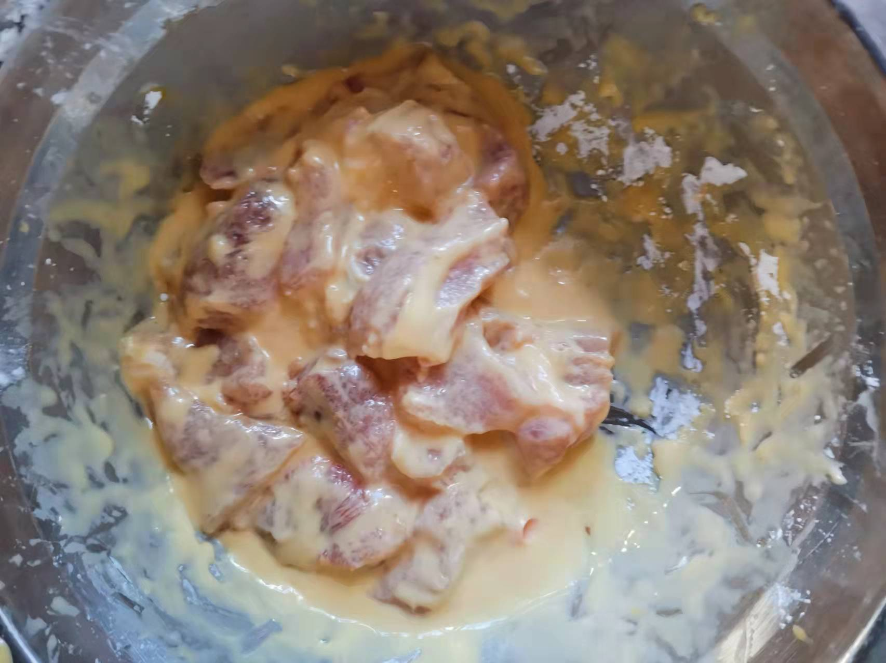
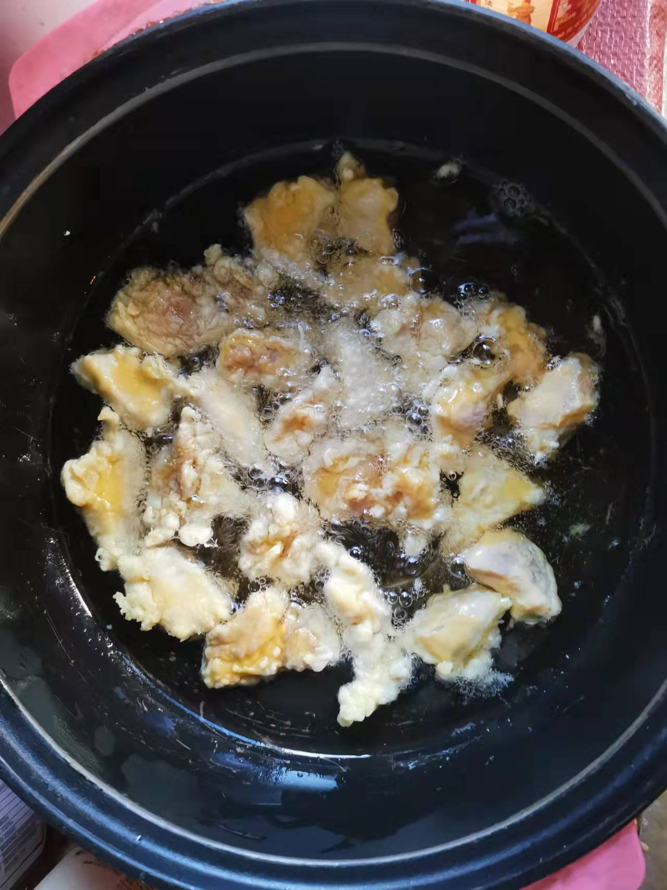
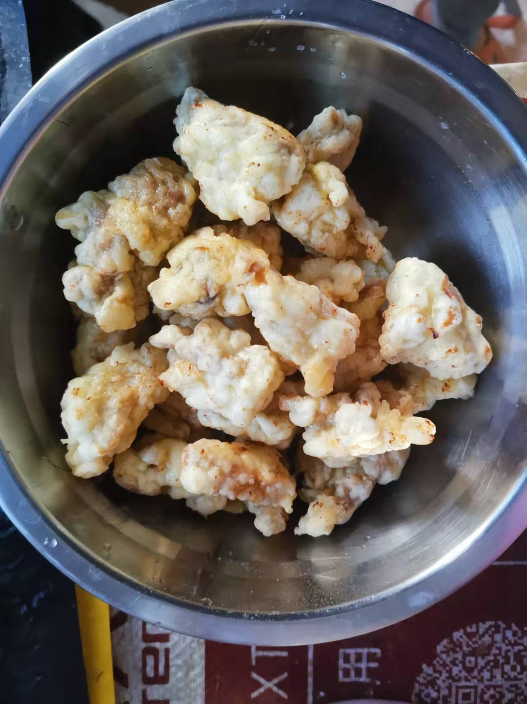
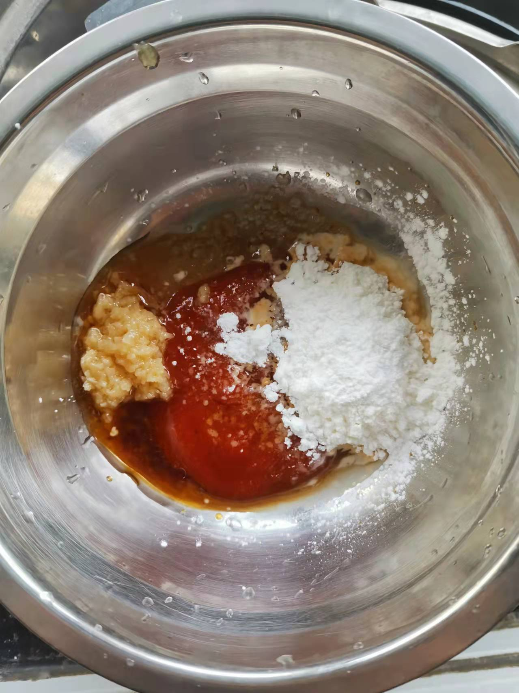

# How to make lychee meat

Lychee meat has unique characteristics of Fujian cuisine and tastes sweet and sour.It is a common dish in Fuzhou

Estimated cooking difficulty: ★★★★

## Essential raw materials and tools

* Lean meat
* Pineapple
* egg
* Edible oil
* White sugar
* starch
* Soup
* Chicken Essence
* ginger powder
* Sesame
* Tomato sauce
* Balsamic vinegar

## calculate

Each serving:

* 2 fresh mushrooms
* Crab Mushroom 30 g
* Lean meat 150 g
* Pineapple 100 g
* 1 egg
* edible oil 500 ml
* White sugar 5 g
* Starch 100 g
* Soup soy sauce 5 ml
* Chicken essence 5 g
* 5 g ginger
* Sesame 2 g
* Tomato sauce 20 g
* Balsamic vinegar 2 ml

## operate

* Cut the lean meat into pieces (2-3 cm each), put it in a large bowl, add 1 egg, 50 g of raw powder, 3 ml of light soy sauce, 2 g of chicken essence
* Stir thoroughly until the raw powder wraps the lean meat pieces (if it is too thin, continue to add raw powder, if it is too dry, add water), then add 5 ml of oil, and set aside after stirring thoroughly
* In preparation of a bowl, add ketchup, 3 g chicken essence, 2 ml of light soy sauce, minced ginger, white sugar, 10 g of raw powder \balsamic vinegar, 200 ml of cold water, stir thoroughly and set aside
* Cut one pineapple and prepare 6 pieces (1.5-2 cm each) pineapple chunks
* Pour oil in the pan, pour 500 ml of oil, and keep burning until you hear the sound of frying
* Put lean meat into the pot one by one (remember not to pour it into the whole bowl) to ensure that each meat does not stick together
* After putting all lean meat, flip the lean meat pieces back and forth with a spoon every 30 S until the lean meat pieces are golden on the surface
* Take out the lean meat, pour it into a frying pan after one minute, and continue to fry until the surface of the lean meat is browned, take it out and put it in a large bowl for later use
*Put the pot, pour in the soup, then pour in the lean meat and pineapple pieces, stir-fry thoroughly and then leave the pot
* Put sesame seeds on it

## Additional content

* In more cases, local areas in Fuzhou will use horse hoof (relieving greasy) and potato (washing oil). Because they can't buy it during the epidemic, they use pineapple.
* Fujian cuisine is mainly sweet. If you can't get used to it, you can give up sugar.
* You can use a spoon to beat the lean meat piece and hear the sound to determine whether the lean meat is fried thoroughly.

If you follow the production process of this guide and find problems or processes that can be improved, please ask an Issue or Pull request.