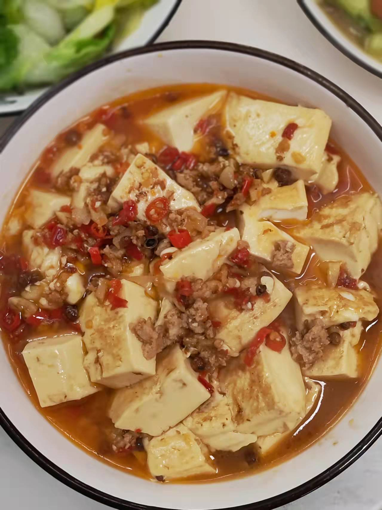

# How to make Mapo tofu

This is a dish created with reference to Mapo tofu.Rich in iron, calcium, phosphorus, magnesium and other essential trace elements in the human body. The most important thing is to eat very well~

Estimated cooking difficulty: ★★★

## Essential raw materials and tools

- Fat tofu (recommended Qingmei)
- Fruit Knife
- Salted duck eggs (recommended by Liufu duck, this is the soul)
- Pork Belly (the meat minced meat in the supermarket is also fine)
- garlic
- Ginger
- Millet pepper (optional if you don’t eat spicy food)
- Spicy sauce (recommended by Guangle)
- Sichuan peppercorn
- Salt
- Soy sauce (Weiji Fresh Soy sauce)

## calculate

- 1 box of fat tofu
- 1 salted duck egg
- 20-30g pork belly
- Two cloves of garlic
- 2 slices of ginger
- 5 millet spicy
- 5g garlic hot sauce
- 20 peppercorns
- 3g salt
- 10g soy sauce

## operate

- Chop garlic and ginger, set aside
- Cut millet spicy into chili circles, set aside
- Cut pork belly into minced meat (I originally bought minced meat to skip)
- Add half of the salt and Weiji fresh soy sauce to the minced meat, stir well and set aside
- Cut the duck eggs in half with a kitchen knife (be careful to be safe), remove the egg yolks (must remove them, otherwise they will be fishy), and mash the remaining egg whites into about 2 mm * 2 mm in size, do not need to be too broken, set aside
- Unpack the tofu and use a fruit knife to cut the tofu in the box to approximately 2.5 cm * 3 cm in size, spare
- Heat the pan and put 10ml - 15ml cooking oil in the pan.Wait for 10 seconds to let the oil temperature rise
- Make it low heat, add garlic, ginger, chili rings, peppercorns, salted duck eggs, and garlic hot sauce for 20 seconds to stir-fry to bring the aroma
- Make the meat to medium heat, add the minced meat, stir-fry for about 1 minute, and the meat will change color
- Make low heat, add tofu, and sprinkle the remaining salt and Weiji fresh soy sauce on the tofu evenly
- Pour boiling water from the edge of the pot (or the tofu will break easily), and just leave the tofu
- Turn on the high heat, turn to medium heat immediately after the water boils, and wait for about 10 minutes
- Wait until only 1/5 of the water is left and the surface of the tofu has been colored, turn off the heat and serve on the plate

## Additional content

- Be sure to observe during this period to prevent the pot from being pasted

If you follow the production process of this guide and find problems or processes that can be improved, please ask an Issue or Pull request.