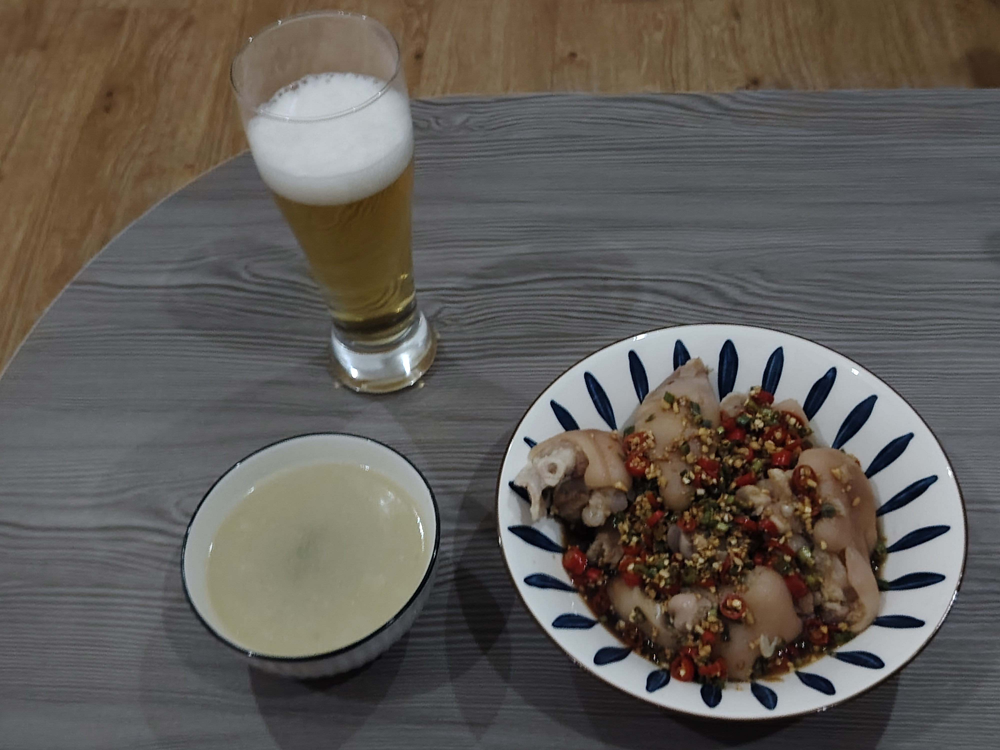
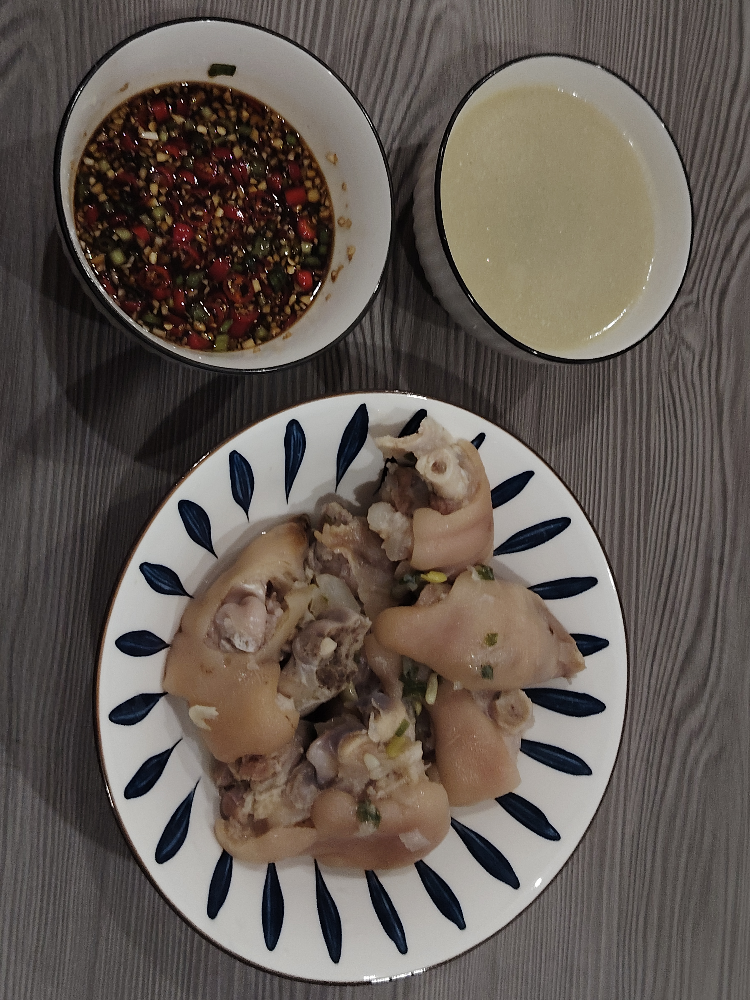

# How to make mother's hoof flowers

Braised pork trotters are nutritious and have a delicate taste, soft and bone-free, and they are so fragrant with spicy and sour sauce!

Estimated cooking difficulty: ★★★★

## Essential raw materials and tools

- Pig's trotters (try to choose pig's front trotters: more meat, more tendons, less bones)
- onion
- ginger
- Cooking wine
- Soup soy sauce
- Bai Zhi
- Angelica (optional)
- Chicken Essence
- Salt
- garlic
- Mizuki
- White pepper
- Soup soy sauce
- Balsamic vinegar
- Pepper oil
- Oil-splashed chili (optional)
- White kidney beans (no kelp available)

## calculate

- Pig's trotters: 3
- White kidney beans: 200g
- Angelica: 2g
- White pepper: 5g
- Ginger slices: 30g
- Angelica: 2g
- Minced garlic: 8g
- Chicken essence: 2g
- Soup soy sauce: 25g
- Onion: 10g

## operate

### Start making

- Soak 200g white kidney beans in clean water one night in advance for later use
- Prepare the pig's front hooves, ask the master to split it from the middle when buying groceries, use a sprinkler to remove the hair follicles, and take it home to clean
- Add pig's trotters, green onion slices, ginger slices, and cooking wine to a cold water pot, blanch for ten minutes, skim off the foam, remove and wash and set aside
- Put pig's trotters, angelica, angelica, white pepper, and ginger slices into the pressure cooker. Press after sprinting for 30 minutes, add white kidney beans, and press for another ten minutes. If the soup base is milky white, then congratulations are correct (if you need to add water in the middle, you can only heat water)

- After removing the cover, add salt, chicken essence and chopped green onion to taste
- Making soul juice: add onion, garlic, millet pepper, white pepper, light soy sauce, balsamic vinegar, oil-splashed chili, pepper oil, pig's trotter soup

- Soul juice, pour it

## Additional content

If you follow the production process of this guide and find problems or processes that can be improved, please ask an Issue or Pull request.