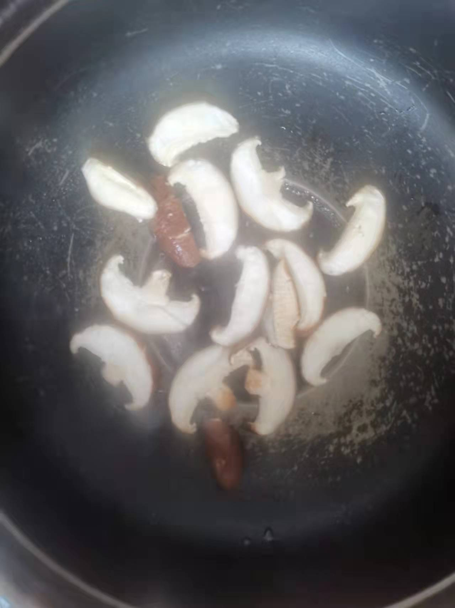
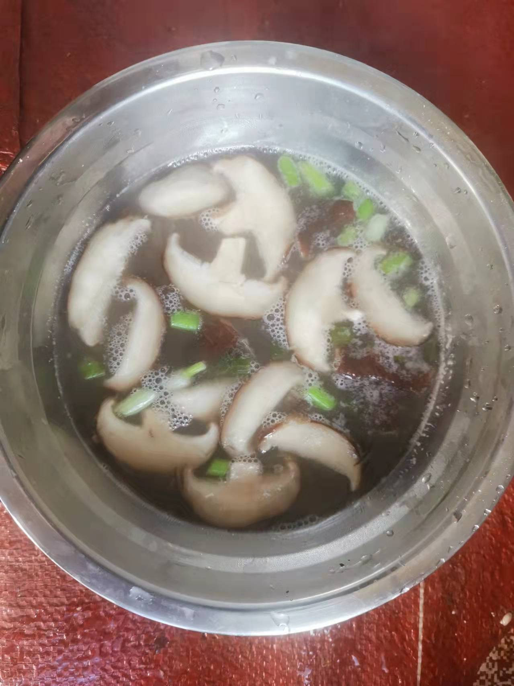

# How to make thickened mushroom soup

In addition to using fresh mushrooms to stir-fry with meat, they are actually very delicious to make thick thickening soup.

Estimated cooking difficulty: ★★★

## Essential raw materials and tools

* mushroom
* Chives
* Edible oil
* Edible salt
* Chicken Essence
* Raw powder

## calculate

Each serving:

* 2 fresh mushrooms
* 0.5 chives
* Chicken essence 3 g
* Edible oil 10 ml
* edible salt 3 g
* Boiling water 350 ml
* Raw powder 10 g

## operate

* Slice mushrooms (each slice is 0.5-1 cm thick, thicker and thinner, more chewy), put in a large bowl, pour in 2g of cooking salt and soak for 15 minutes
* Pour the raw powder into a small bowl, add 50ml of water, and stir the raw powder until it melts without granules (i.e. water starch)
* Pour out the salt water in the bowl and appropriately remove the moisture of the mushrooms (to facilitate the next step of frying) [Optional]
* Pour in the oil on low heat, wait for the oil to start bubbles (low heat for 30 seconds, look at the power of each pot), pour in the mushrooms and fry for 10 seconds per side [Optional]
* Pour in 300ml of boiling water, simmer over medium heat for 3-5 minutes
* Pour in the starch in the water, stir the soup in the pot properly, add 3g of salt and 3g, and finally sprinkle with chopped green onion and put it out of the pot

## Additional content

If you follow the production process of this guide and find problems or processes that can be improved, please ask an Issue or Pull request.